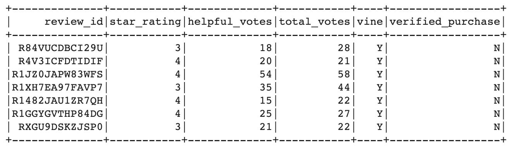
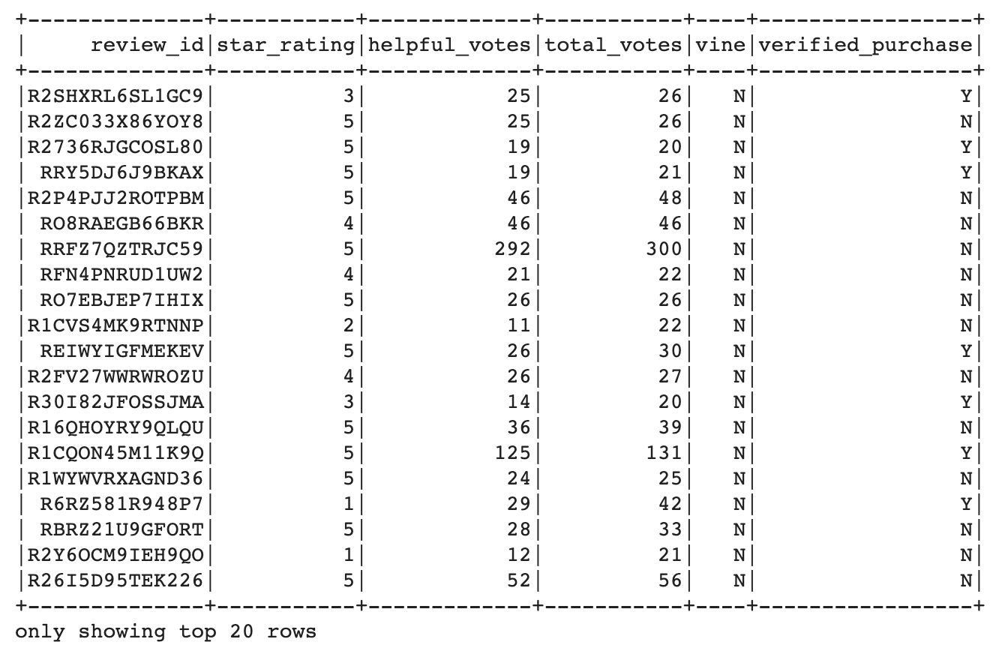

# Amazon Vine Analysis

## Project Overview
In this project, I was tasked with analyzing big data using PySpark, Google Colab, pgAdmin, and AWS Relational Database System. Specifically, I was to analyze a dataset of Amazon reviews that were either paid (Vine) or unpaid (non-Vine) to uncover whether or not there is positivity bias for reviews in the Vine program. To do so, I created several tables and used filters to eventually achieve the necessary tables and numbers.

## Results
1. How many Vine reviews and non-Vine reviews were there?
- There were 7 vine reviews and 105979 non-Vine reviews.

2. How many Vine reviews were 5 stars? How many non-Vine reviews were 5 stars?
- 0 Vine reviews were 5 stars.
- 67580 non-Vine reviews were 5 stars.

3. What percentage of Vine reviews were 5 stars? What percentage of non-Vine reviews were 5 stars?
- The percentage of Vine reviews that were 5 stars is 0%.
- The percentage of non-Vine reviews that were 5 stars is 63.8%.

Shown below is the Vine DataFrame and the first 20 rows of the non-Vine DataFrame:
Vine:

Non-Vine:

## Summary
Because there were a very small number of Vine reviews, I am unable to conclude whether or not there is any positivity bias for reviews in the Vine program. To find out more information and hopefully come to a conclusion, I would repeat this analysis with several other datasets to gather a larger sample of data. This would allow me to draw a more concrete conclusion than I was able to from the dataset I chose to work with. However, it is important to note that the 5-star percentage for non-Vine reviews was relatively high at 63.8%.
